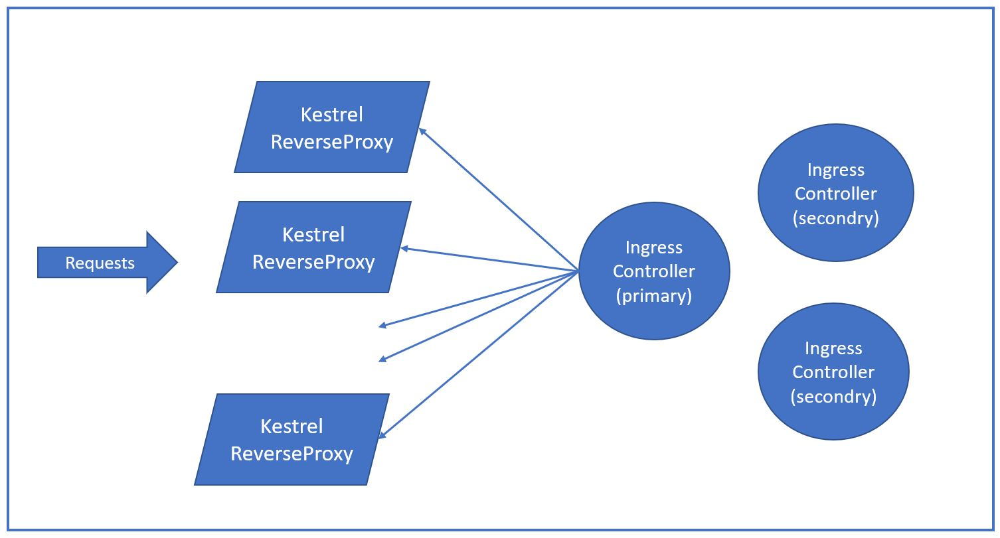

# ReverseProxy
Kubernetes Ingress-Controller using Kestrel based ReverseProxy.

### Separating the logic of ReverseProxy and Ingress-Controller.

Ingress-Controller runs as a primary/secondary mode with three replicas. This approach limits the number of readers from kubernetes-master to just three. And helps when the Front-End (ReverseProxy) needs to scale to a very high number.

Primary Replica is responsible for updating all the ReverseProxy pods. Implies, all the ReverseProxy pods are in a consistent state as the ingress-controller primary is the single source of truth (rather than each of them reading from k8s-master themselves).

ReverseProxy can be scaled to any number of pods which receive the requests and pass them along to the Kubernetes services.

## Docker setup:

1. Install Docker Desktop for Windows (https://docs.docker.com/docker-for-windows/install/#install-docker-desktop-on-windows)

2. Switch to Windows containers (Right click "Docker Whale" in System tray)

3. Build docker image "reverseproxy:test1" for ReverseProxy
    > ReverseProxy\Docker> docker build --pull -t reverseproxy:test1 -f ReverseProxy.dockerfile ..\

4. Run the docker image locally and point the traffic on "8000" to the doker container
    > ReverseProxy\Docker> docker run --rm -it -p 8000:80 reverseproxy:test1

5. Test the webservice default path:

http://localhost:8000/weatherforecast1

